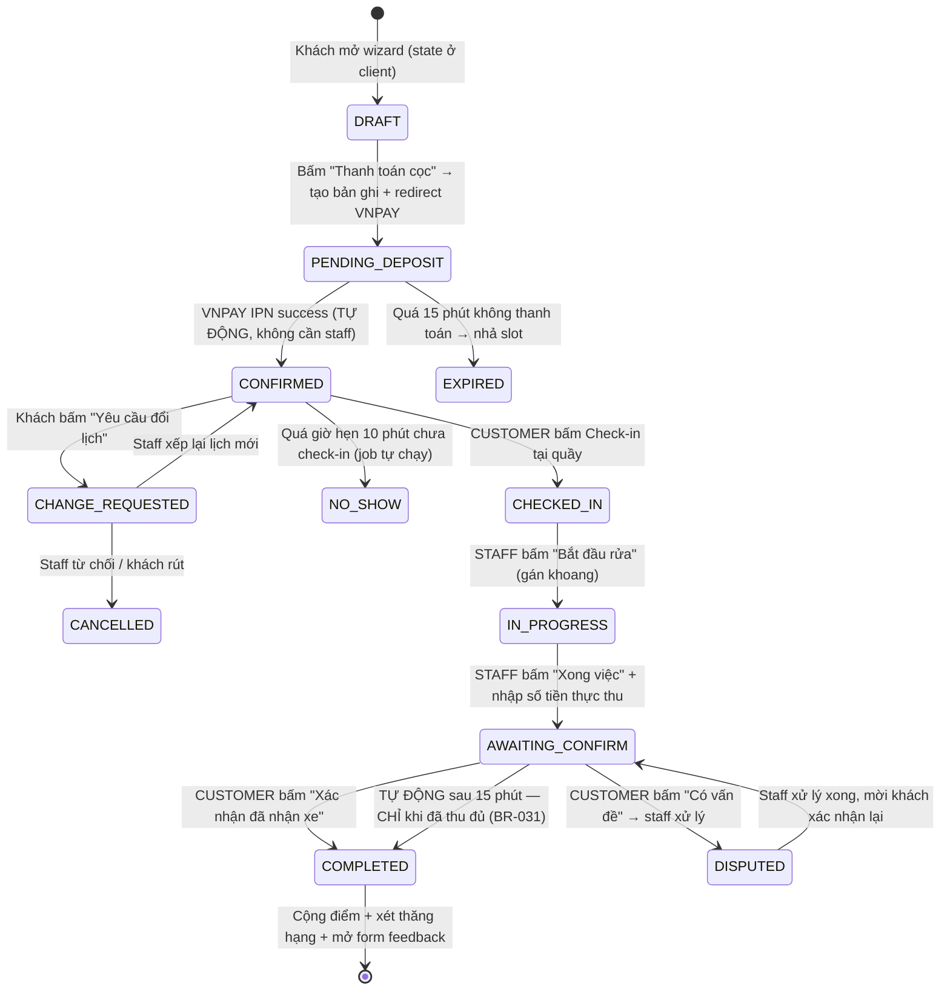

# 01 — LUỒNG CHẠY MỚI (End-to-End Flow)

> Thay thế phần luồng trong `results/FR-004`, `FR-005`, `FR-009`.
> Quyết định nguồn: D-01, D-02, D-08, D-09 tại [00-QUYET-DINH-REFACTOR.md](00-QUYET-DINH-REFACTOR.md).

---

## 1. Vòng đời Booking (State Machine)



### 1.1. Ai được làm gì (RBAC)

| Chuyển trạng thái | GUEST | CUSTOMER | STAFF | ADMIN |
| :-- | :-: | :-: | :-: | :-: |
| `DRAFT → PENDING_DEPOSIT` | ✅ | ✅ | ❌ | ❌ |
| `PENDING_DEPOSIT → CONFIRMED` | 🤖 Hệ thống (VNPAY IPN) | 🤖 | ❌ | ❌ |
| `PENDING_DEPOSIT → EXPIRED` | 🤖 Job 15 phút | 🤖 | ❌ | ❌ |
| `CONFIRMED → CHECKED_IN` | ✅ (qua mã tra cứu) | ✅ | ⚠️ Hộ khách, có ghi log | ✅ |
| `CONFIRMED → NO_SHOW` | 🤖 Job quét mỗi phút | 🤖 | ❌ | ✅ Ghi đè thủ công |
| `CONFIRMED → CHANGE_REQUESTED` | ✅ | ✅ | ❌ | ❌ |
| `CHECKED_IN → IN_PROGRESS` | ❌ | ❌ | ✅ | ✅ |
| `IN_PROGRESS → AWAITING_CONFIRM` | ❌ | ❌ | ✅ | ✅ |
| `AWAITING_CONFIRM → COMPLETED` | ✅ | ✅ | ❌ **Cấm tuyệt đối** | ⚠️ Chỉ khi khách khiếu nại, bắt buộc ghi lý do vào audit log |
| `AWAITING_CONFIRM → COMPLETED` (tự động) | 🤖 Job 15 phút | 🤖 | ❌ | ❌ — **chỉ chạy khi `paid_amount >= total_amount`** (BR-031) |
| `CONFIRMED → CONFIRMED` (đổi lịch) | ❌ | ❌ | ❌ | ✅ Bắt buộc lý do + tự báo khách (BR-033) |
| `* → CANCELLED` | ❌ | ❌ | ✅ | ✅ |

> 🔒 **Điểm kiểm soát then chốt**: STAFF **không bao giờ** được tự chuyển sang `COMPLETED`. Đây chính là chốt chặn cho rủi ro gian lận nội bộ mà `source/Phân Tích Dự Án AutoWash.md` đã cảnh báo. Admin ghi đè được nhưng **bắt buộc** ghi `override_reason` + `override_by` vào `audit_logs`.

### 1.2. Vì sao tách `IN_PROGRESS` và `AWAITING_CONFIRM`?

Nếu đi thẳng `CHECKED_IN → COMPLETED` thì khách phải ngồi bấm nút đúng lúc thợ rửa xong — không thực tế. Tách ra để:

* `IN_PROGRESS`: khách nhìn app biết xe **đang được rửa**, còn bao lâu nữa (dựa trên `duration_min`).
* `AWAITING_CONFIRM`: thợ báo xong, app khách **rung/thông báo** → khách ra xem xe → hài lòng thì bấm xác nhận, không hài lòng thì bấm "Có vấn đề".

Đây cũng là chỗ gắn **lỗi #13 (chưa có feedback/rating)**: form đánh giá bật lên ngay sau khi bấm xác nhận, lúc trải nghiệm còn nóng hổi → tỉ lệ trả lời cao nhất.

---

## 2. Luồng đặt lịch 6 bước (thứ tự MỚI)

```
┌─────────┐  ┌──────────┐  ┌──────────┐  ┌─────────┐  ┌─────────┐  ┌──────────┐
│    1    │→ │    2     │→ │    3     │→ │    4    │→ │    5    │→ │    6     │
│Chi nhánh│  │ Dịch vụ  │  │ Ngày giờ │  │ Chọn xe │  │ Xem lại │  │ Xác nhận │
└─────────┘  └──────────┘  └──────────┘  └─────────┘  └─────────┘  └──────────┘
                  ↑              ↑             ↑            ↑
             lưới icon      dải ngang +    size suy ra   TÍNH LẠI
             + modal        lịch tháng     từ xe        GIÁ CHÍNH XÁC
                  │                                          │
             giá "từ X đ" ──────────────────────────────► giá cuối
```

### Bước 1 — Chọn chi nhánh
* Nguồn: `GET /api/v1/branches`
* Hiển thị: tên, địa chỉ, tag khu vực, badge *"Còn N slot hôm nay"*
* Chi nhánh có `booking_enabled = false` → hiện xám + `booking_notice`

### Bước 2 — Chọn dịch vụ (lưới icon → modal)
* Chi tiết UI: [04-UI-UX-SPEC.md §5.1–5.3](04-UI-UX-SPEC.md)
* Đóng modal → quay về trang lưới icon, hiện **dải nhắc inline** *"Chọn thêm dịch vụ khác?"* — **không dùng dialog** (D-16)
* Giá hiển thị theo **Sedan (hệ số 1.0)** kèm nhãn **"từ"** — vì chưa biết xe
* Giỏ hàng sticky đáy màn: `N dịch vụ · từ 230.000đ · [Tiếp tục]`
* Cảnh báo trùng: tick dịch vụ đã nằm trong combo → toast *"Gói VW Ultimate đã bao gồm Khử mùi C-AirFog rồi"* (D-06)

### Bước 3 — Chọn ngày & giờ *(cập nhật D-14, D-15)*
* **Lưới tuần 8 cột × 44 hàng**, mốc **15 phút**, `07:00 → 18:00`. Cột giờ dính trái, hàng ngày dính trên. Bố cục theo ảnh mẫu — chi tiết [04 §5.4](04-UI-UX-SPEC.md)
* Điều hướng: hai nút mũi tên đi từng tuần + dropdown chọn tháng
* Số ngày chọn được giới hạn theo cửa sổ đặt trước của hạng (BR-004)
* Slot bị chặn nếu: hết khoang hợp loại (BR-029) · vừa bị người khác giữ chỗ (BR-030) · không đủ ô liên tiếp cho tổng thời gian chiếm dụng · sớm hơn `min_advance` **90 phút** (BR-016b — sửa lỗi #8)
* Ô hiển thị 5 trạng thái: `○` còn chỗ · `◐` còn 1 khoang · `●` đang chọn · `✕` hết · `–` ngoài giờ
* Dịch vụ `booking_mode = flexible` (ceramic, PPF, đánh bóng…): **không khóa slot cứng**, chỉ ghi nhận giờ mong muốn, staff xác nhận lại

### Bước 4 — Chọn xe
* Đã đăng nhập → chọn từ Garage (FR-003). Chưa có xe → nút *"+ Thêm xe"* mở modal ngay tại chỗ, không rời wizard
* Guest → nhập biển số + hãng + dòng xe + chọn size thủ công
* **Size xe suy ra từ hồ sơ xe**, không hỏi lại khách

### Bước 5 — Xem lại (nơi chốt giá)
* Bảng chi tiết từng dịch vụ: `Giá gốc (Sedan) → × hệ số size → Thành tiền`
* Dòng riêng: `Điều chỉnh theo size SUV/CUV (×1.2) : +46.000đ`
* Áp voucher (chỉ member) — chọn từ ví voucher, kiểm tra điều kiện hạng (**lỗi #16**)
* Hiện rõ: **Tổng đơn** / **Cọc phải trả ngay** / **Còn lại trả tại quầy**
* Nút ✏️ Sửa cho từng khối, nhảy về đúng bước tương ứng, **giữ nguyên mọi lựa chọn cũ**

### Bước 6 — Xác nhận & thanh toán cọc
* Guest → chặn tại đây, yêu cầu OTP số điện thoại (xem §4)
* Tạo booking `PENDING_DEPOSIT` → redirect VNPAY
* VNPAY IPN thành công → `CONFIRMED` + gửi email/SMS + tạo mã `AWP-XXXXXX`
* Thất bại / hủy giữa chừng → giữ `PENDING_DEPOSIT`, cho thử lại trong 15 phút

---

## 3. Ràng buộc 1 booking / khách (sửa lỗi #9)

**Lỗi #9**: *"NEW BOOKING BỊ LỖI PENDING DÙ CHƯA TẠO BOOKING"* — nguyên nhân gốc là BR-012 đếm cả các bản ghi rác `PENDING` do khách bỏ dở giữa chừng.

**Cách sửa**:

1. Chỉ tạo bản ghi DB ở **bước 6**, không tạo ở bước 1. Bước 1→5 là state trong `BookingContext` phía client.
2. Định nghĩa lại "booking đang hoạt động" = trạng thái ∈ `{CONFIRMED, CHECKED_IN, IN_PROGRESS, AWAITING_CONFIRM}`.
   `PENDING_DEPOSIT` **KHÔNG** tính là đang hoạt động.
3. Job dọn rác chạy mỗi phút: `PENDING_DEPOSIT` quá 15 phút → `EXPIRED`, nhả slot.
4. Index `(customer_id, status)` để câu kiểm tra chạy nhanh.

```sql
-- Câu kiểm tra đúng
SELECT COUNT(*) FROM bookings
WHERE customer_id = ?
  AND status IN ('CONFIRMED','CHECKED_IN','IN_PROGRESS','AWAITING_CONFIRM');
-- > 0  →  409 Conflict
```

---

## 4. Guest & chiến lược chuyển đổi thành member (D-09)

Guest **đặt được** nhưng bị giới hạn. Quan trọng: không chặn cứng, mà **cho thấy họ đang mất gì**.

| Khả năng | Guest | Member |
| :-- | :-: | :-: |
| Đặt lịch, thanh toán cọc | ✅ | ✅ |
| Tự check-in bằng mã tra cứu | ✅ | ✅ |
| Tích điểm | ❌ | ✅ |
| Dùng / nhận voucher | ❌ | ✅ |
| Đánh giá dịch vụ | ❌ | ✅ |
| Lưu xe vào Garage | ❌ | ✅ |
| Cửa sổ đặt trước | 7 ngày | 7–14 ngày theo hạng |

### 4 điểm chạm khuyến khích tạo tài khoản

1. **Bước 5 (Xem lại)** — banner nhẹ, không chặn:
   > 🎁 *Tạo tài khoản miễn phí để nhận **230 điểm** cho đơn này và voucher 50.000đ cho lần sau.*
   Con số điểm tính thật từ đơn hiện tại → cụ thể, không chung chung.

2. **Bước 6 (Xác nhận)** — dù sao cũng phải xác thực OTP số điện thoại để giữ chỗ.
   Sau khi OTP đúng: *"Đặt chỗ đã giữ. Tạo mật khẩu để lưu tài khoản?"* — chỉ thêm **1 ô input**.
   👉 Đây là điểm chuyển đổi hiệu quả nhất: khách đã bỏ công điền hết rồi.

3. **Sau khi `COMPLETED`** — màn cảm ơn:
   > *Đơn này lẽ ra được **230 điểm**. Tạo tài khoản trong 7 ngày, chúng tôi vẫn cộng bù cho bạn.*
   Điểm treo lưu ở bảng `pending_points` khóa theo số điện thoại, hết 7 ngày thì xóa.

4. **Tại cửa hàng** — staff có màn "Mời tạo tài khoản": quét số điện thoại khách vừa dùng → gửi link đăng ký 1 chạm. Đo được tỉ lệ chuyển đổi theo từng nhân viên.

---

## 5. API Contract (thay thế FR-005 §3.2 và FR-009 §3.1)

```
POST   /api/v1/bookings                      Tạo booking → PENDING_DEPOSIT
GET    /api/v1/bookings/{ref}                Tra cứu (guest dùng ref + phone)
POST   /api/v1/payments/vnpay/create         Sinh URL thanh toán cọc
POST   /api/v1/payments/vnpay/ipn            VNPAY callback → auto CONFIRMED
GET    /api/v1/payments/vnpay/return         Trang khách quay lại sau thanh toán

POST   /api/v1/bookings/{id}/check-in        [CUSTOMER] CONFIRMED → CHECKED_IN
POST   /api/v1/bookings/{id}/start           [STAFF]    CHECKED_IN → IN_PROGRESS
POST   /api/v1/bookings/{id}/finish          [STAFF]    IN_PROGRESS → AWAITING_CONFIRM
POST   /api/v1/bookings/{id}/confirm         [CUSTOMER] AWAITING_CONFIRM → COMPLETED
POST   /api/v1/bookings/{id}/dispute         [CUSTOMER] AWAITING_CONFIRM → DISPUTED
POST   /api/v1/bookings/{id}/change-request  [CUSTOMER] CONFIRMED → CHANGE_REQUESTED
PATCH  /api/v1/bookings/{id}/vehicle-size    [STAFF]    Sửa size, tính lại số dư
POST   /api/v1/bookings/{id}/feedback        [CUSTOMER] Sau COMPLETED
GET    /api/v1/branches/{id}/slots?date=&duration=   Slot trống theo tổng thời lượng
```

### Payload mẫu — `POST /api/v1/bookings`

```json
{
  "branchId": 1,
  "vehicleId": "v-71a3-...",
  "guestVehicle": null,
  "bookingDate": "2026-07-25",
  "bookingTime": "10:00",
  "items": [
    { "serviceId": 1, "quantity": 1 },
    { "serviceId": 5, "quantity": 1 }
  ],
  "voucherId": null,
  "note": "Xe mới đi mưa, nội thất hơi ẩm"
}
```

### Response `201 Created`

```json
{
  "bookingRef": "AWP-381927",
  "status": "PENDING_DEPOSIT",
  "pricing": {
    "subtotal": 230000,
    "sizeMultiplier": 1.2,
    "sizeAdjustment": 46000,
    "voucherDiscount": 0,
    "total": 276000,
    "depositRequired": 50000,
    "payAtCounter": 226000
  },
  "depositExpiresAt": "2026-07-20T14:15:00+07:00",
  "paymentUrl": "https://sandbox.vnpayment.vn/paymentv2/vpcpay.html?..."
}
```

### Mã lỗi

| HTTP | Khi nào | Thông điệp |
| :-- | :-- | :-- |
| `409` | Khách đã có booking đang hoạt động | "Bạn đang có 1 lịch hẹn chưa hoàn tất (AWP-381927)." |
| `409` | Slot vừa bị người khác đặt mất | "Khung giờ này vừa có người đặt. Vui lòng chọn giờ khác." |
| `400` | Đặt sớm hơn `min_advance` | "Vui lòng đặt trước ít nhất 90 phút." |
| `400` | Voucher hết hạn / sai hạng | "Voucher không áp dụng cho hạng thành viên của bạn." |
| `403` | Staff gọi endpoint `/confirm` | "Chỉ khách hàng mới xác nhận hoàn thành dịch vụ." |
| `410` | Booking đã `EXPIRED` | "Lịch đặt đã hết hạn giữ chỗ. Vui lòng đặt lại." |

---

## 6. Job nền (Scheduled Jobs)

| Job | Tần suất | Việc làm |
| :-- | :-- | :-- |
| `ExpirePendingDeposits` | 1 phút | `PENDING_DEPOSIT` quá 15 phút → `EXPIRED`, nhả slot |
| `MarkNoShow` | 1 phút | `CONFIRMED` quá giờ hẹn 10 phút → `NO_SHOW`, ghi vào hồ sơ khách |
| `RemindBooking` | 1 giờ | Nhắc lịch trước **1 ngày** (yêu cầu trong `source/update.md`) |
| `ExpirePoints` | 02:00 hằng ngày | Điểm quá 12 tháng → hết hạn (BR-008) |
| `ReviewTierDowngrade` | 02:00–04:00 ngày 1 hằng tháng | Rà hạ hạng theo rolling 12 tháng (BR-007) |
| `ReleaseExpiredHolds` | 1 phút | Xóa `slot_reservations` có `status = HOLD` quá hạn → nhả khoang (BR-030) |
| `AutoConfirmCompleted` | 1 phút | `AWAITING_CONFIRM` quá 15 phút **và đã thu đủ tiền** → `COMPLETED` (BR-031) |

---

## 7. Khoang rửa & sức chứa (D-17)

Thiết kế cũ giả định **1 booking = 1 slot**, nên không mô tả được tình huống combo 1 giờ đè lên gói lẻ cùng khung giờ. Nguyên nhân: **thiếu khái niệm khoang**.

Mỗi chi nhánh có **4 khoang**:

| Khoang | Loại | Nhận dịch vụ |
| :-- | :-- | :-- |
| Bay 1, Bay 2 | `QUICK` | `booking_mode = slot` — rửa xe, combo |
| Bay 3 | `DETAIL` | `booking_mode = flexible` — ceramic, PPF, nội thất, dầu, lốp |
| Bay 4 | `UNIVERSAL` | Mọi loại — van xả khi một nhóm quá tải |

```
Slot t còn nhận được  ⟺  tồn tại 1 khoang hợp loại trống suốt [t, t + tổng_chiếm_dụng)
```

**Ví dụ** — combo 1 giờ 13:00–14:00 và gói lẻ trùng khung giờ:

```
          13:00   13:15   13:30   13:45   14:00
Bay 1 Q  │███████████████████████████████│         Combo 1h  — khách A
Bay 2 Q  │        ███████████████│                 Gói lẻ 30′ — khách B  ✅
Bay 3 D  │  (chỉ nhận flexible, combo không vào được)
Bay 4 U  │        ███████████████████████│         Gói lẻ 45′ — khách C  ✅
                  ↑ khách D lúc 13:15 → ❌ hết khoang hợp lệ
```

Khách D **không** chỉ nhận lỗi — hệ thống trả về 3 khung giờ trống gần nhất, bấm là chọn luôn.

Thuật toán xếp khoang ưu tiên khoang chuyên dụng trước, để dành `UNIVERSAL` làm dự phòng. Mã giả: [PLAN-V2 §5.2](PLAN-V2-LAM-LAI-FE.md).

---

## 8. Chống 2 người đặt cùng slot (D-18)

**Tính đúng đắn do tầng dữ liệu bảo đảm, không do code.**

```sql
CREATE TABLE slot_reservations (
    id          BIGINT PRIMARY KEY IDENTITY,
    branch_id   INT NOT NULL,
    bay_id      INT NOT NULL,
    slot_time   DATETIME2 NOT NULL,
    booking_id  VARCHAR(36) NOT NULL,
    status      VARCHAR(10) NOT NULL,        -- 'HOLD' | 'BOOKED'
    expires_at  DATETIME2 NULL,
    CONSTRAINT UX_bay_slot UNIQUE (bay_id, slot_time)
);
```

```
Khách bấm "Thanh toán cọc"
   │
   ├─ 1. BEGIN TRANSACTION
   │     allocate() chọn khoang
   │     INSERT slot_reservations (HOLD, expires_at = now + 15′) × N slot
   │     ├─ OK → COMMIT → booking PENDING_DEPOSIT → URL VNPAY
   │     └─ DuplicateKeyException → ROLLBACK → 409 + 3 slot thay thế
   │
   ├─ 2. Idempotency-Key — chính khách đó bấm 2 lần → trả kết quả cũ
   ├─ 3. VNPAY IPN thành công → UPDATE status = 'BOOKED', expires_at = NULL
   ├─ 4. Job mỗi phút xóa HOLD quá hạn → nhả khoang
   └─ 5. FE polling 10 giây ở bước chọn giờ → ô slot tự khóa, hiện "Còn 1 chỗ"
```

**Không dùng Redis** — unique index của SQL Server đã cho tính đúng đắn tuyệt đối ở mức đồng thời của đồ án. Thêm Redis là thêm hạ tầng phải cài, vận hành và đồng bộ; rủi ro lớn hơn lợi ích. Ghi rõ lập luận này để trả lời nếu bị hỏi.

**Test bắt buộc**: 2 trình duyệt cùng chọn slot 10:00, bấm cách nhau < 1 giây → đúng 1 người vào VNPAY, người kia nhận `409`. Không được có trường hợp cả hai cùng thành công.
