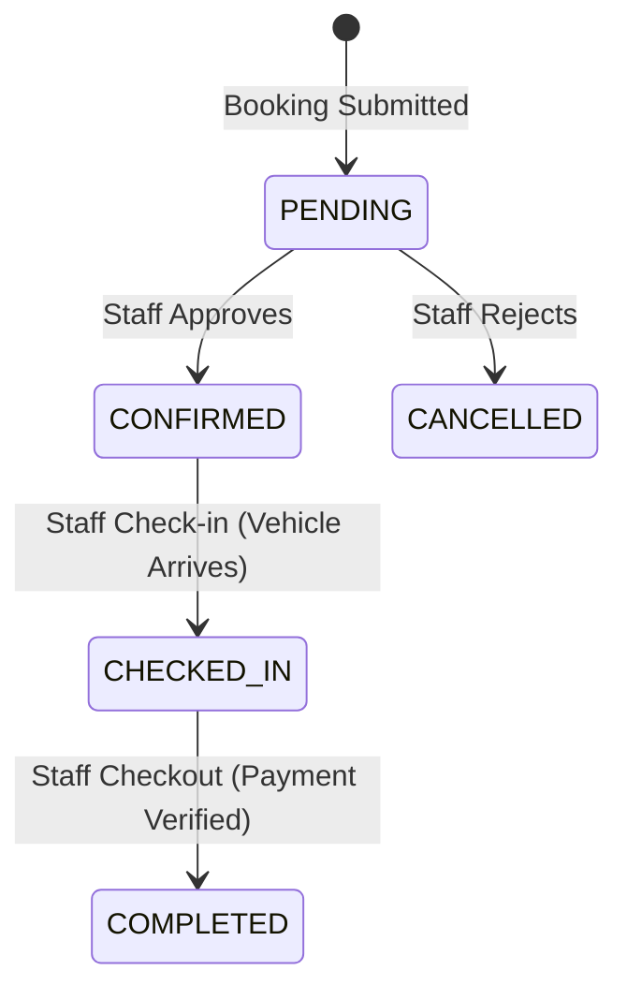

# Technical Specification: [FR-009] Washing Counter Queue Operations

This document specifies the technical design, requirements, and BDD verification scenarios for the Washing Counter (LPR) operational workflow, queue state transitions, and checkout completions.

* **Parent Epic**: `EPIC: FR-001..FR-013 Delivery`
* **Milestone**: Release 1.0
* **Priority**: `priority:high`
* **Estimate**: 4 days
* **Functional Area**: `area:reporting`

---

## 1. Functional & Business Logic Analysis

### 1.1. Granular Operations (CRUD Matrix)

* **Create**: None.
* **Read**: Query lists of bookings filtered by status (`PENDING`, `CONFIRMED`, `CHECKED_IN`).
* **Update**: Modify booking status values through the lifecycle phases.
* **Delete**: None.

### 1.2. Status Lifecycle Transitions



### 1.3. Business Rules & Constraints

* **Checkout Validation**: Checkout is blocked unless the staff enters the actual paid cash amount.
* **Points Credit Trigger**: The point calculation and welcome gift generation are dispatched asynchronously when the booking transitions to `COMPLETED`.
* **Voucher Consumption**: Completing checkout transitions the applied voucher status from `LOCKED` to `USED`.

### 1.4. Role-Based Access Control (RBAC)

* **Authorized Roles**: Washing Counter Staff and Admin.
* **Security Restrictions**: Customers cannot access status update endpoints. Unauthorized requests return `403 Forbidden`.

---

## 2. Front-end Specifications (FE)

### 2.1. UI/UX Layout & Wireframe Concept

* **Layout**: Configured in [WashingCounterPage.tsx](file:///d:/demoSWP/Vehicles-washing-G4-5/Front-end/src/pages/washing-counter/WashingCounterPage.tsx). Displays three task columns for managing states.
* **Wireframe (Queue Columns)**:

    ```text
    +---------------------------------------------------------------+
    | [ Pending ]            [ Confirmed ]          [ Checked-In ]  |
    +---------------------------------------------------------------+
    | John - 51G-123.45      Jane - 51A-999.99      Bob - 51C-777.77|
    | Basic Wash - Sedan     Ultimate Wash          Detail Wash     |
    | [ Approve ] [ Reject ] [ Check-in ]           [ Checkout ]    |
    +---------------------------------------------------------------+
    ```

### 2.2. Components & Interactive Controls

* **Action triggers**: Click handlers for status transitions.
* **Checkout Modal Form**: Input field for Cash Received (VND) showing estimated points to earn.

---

## 3. Back-end Specifications (BE)

### 3.1. RESTful API Contract

#### Transition Booking Status

* **Method & Path**: `PUT /api/bookings/{id}/status`
* **Auth**: Bearer Staff JWT
* **Request Payload**:

    ```json
    {
      "status": "CONFIRMED"
    }
    ```

* **Response Payload (200 OK)**:

    ```json
    {
      "success": true,
      "id": "b71a3962-cf3f-4279-994b-e85d45d3c8d0",
      "status": "CONFIRMED"
    }
    ```

#### Checkout Booking

* **Method & Path**: `POST /api/bookings/{id}/checkout`
* **Request Payload**:

    ```json
    {
      "actualPaid": 230000
    }
    ```

* **Response Payload (200 OK)**:

    ```json
    {
      "success": true,
      "pointsEarned": 230,
      "newTier": "Silver"
    }
    ```

---

## 4. Acceptance Criteria (AC)

### AC-1: Booking Check-in Transition (Happy Path)

* **Given** a booking has status `CONFIRMED`.
* **When** the staff clicks "Check-in" in the queue.
* **Then** the client PUTs to `/api/bookings/{id}/status` with `status = 'CHECKED_IN'`.
* **And** the card moves to the Checked-In column.

### AC-2: Checkout Completes & Credits Points (Happy Path)

* **Given** a booking has status `CHECKED_IN`.
* **When** the staff clicks "Checkout", enters the payment amount, and submits the checkout.
* **Then** the backend updates the booking status to `COMPLETED`.
* **And** credits points to the customer's account.

### AC-3: Unauthorized Status Update Block (Edge Case)

* **Given** a Customer tries to directly invoke `PUT /api/bookings/123/status` using their customer JWT.
* **When** the server processes the request.
* **Then** it must reject the request with `403 Forbidden`.

### AC-4: Checkout Voucher Transition (Edge Case)

* **Given** a booking has status `CHECKED_IN` and has a voucher locked (`LOCKED`).
* **When** the staff completes checkout.
* **Then** the locked voucher's status in the database must transition to `USED`.

---

## 5. Task Assignments & Detailed Breakdowns

### 👥 Task Assignments & Pair Programming Roles

* **Front-end Developers**: **An & Nguyen**
* **Back-end Developers**: **Phat & Binh**

### 📝 Detailed Sub-task Breakdowns

* **Front-end Development (An & Nguyen)**:
  * `[ ]` Design Washing Counter page for staff (display queue list, status): **An** (Lead) & **Nguyen** (Support/Review)
  * `[ ]` Setup interactive buttons: Approve booking, Check-in (vehicle arrival), Checkout & Points accumulation (completion): **Nguyen** (Lead) & **An** (Support/Review)
* **Back-end Development (Phat & Binh)**:
  * `[ ]` REST API to update booking lifecycle status (`PENDING` -> `CONFIRMED` -> `CHECKED_IN` -> `COMPLETED`): **Phat** (Lead) & **Binh** (Support/Review)
  * `[ ]` Mechanism to automatically trigger points accumulation for customer when booking transitions to `COMPLETED`: **Phat** (Lead) & **Binh** (Support/Review)
