# Effort Sizing & Effort Chart: AutoWash Pro

This document details the estimated effort (in developer days) for each Functional Requirement (FR) and visualizes the effort distribution across the functional areas.

---

## 1. Effort Sizing Table

| ID | Functional Requirement | Functional Area | Estimate (Days) | Priority (Wiegers) |
| :--- | :--- | :--- | :--- | :--- |
| **FR-001** | Customer Registration & Firebase OTP | `area:foundation` | 3 | `priority:high` |
| **FR-002** | Customer Login & Password Auth | `area:foundation` | 2 | `priority:high` |
| **FR-003** | Vehicle CRUD Management | `area:foundation` | 3 | `priority:medium` |
| **FR-004** | 6-Step Booking Wizard Navigation | `area:foundation` | 5 | `priority:high` |
| **FR-005** | Booking Checkout & VietQR Payment | `area:foundation` | 3 | `priority:high` |
| **FR-006** | Loyalty Point Accumulation | `area:reporting` | 2 | `priority:high` |
| **FR-007** | Loyalty Tier Upgrade & Expiration | `area:reporting` | 3 | `priority:high` |
| **FR-008** | Rewards Redemption & Vouchers | `area:reporting` | 3 | `priority:medium` |
| **FR-009** | Washing Counter Queue Operations | `area:reporting` | 4 | `priority:high` |
| **FR-010** | Admin Customer Directory CRUD | `area:exceptions` | 4 | `priority:medium` |
| **FR-011** | Admin Booking Infinite Scroll | `area:exceptions` | 3 | `priority:low` |
| **FR-012** | Admin Income Statistics & Logs | `area:exceptions` | 4 | `priority:medium` |
| **FR-013** | AI Campaign & Promotion Builder | `area:exceptions` | 4 | `priority:low` |
| **Total** | **13 Core Requirements** | — | **43 Days** | — |

---

## 2. Mermaid Effort Distribution Chart

```mermaid
gantt
    title AutoWash Pro Sizing & Effort Distribution (Days)
    dateFormat  X
    axisFormat %d
    
    section area:foundation
    [FR-001] OTP Signup     :active, 0, 3
    [FR-002] Login          : 0, 2
    [FR-003] Vehicle CRUD   : 0, 3
    [FR-004] Wizard Flow    : 0, 5
    [FR-005] VietQR Payment : 0, 3
    
    section area:reporting
    [FR-006] Points Earn    : 0, 2
    [FR-007] Tier Engine    : 0, 3
    [FR-008] Redeem Shop    : 0, 3
    [FR-009] Counter Queue  : 0, 4
    
    section area:exceptions
    [FR-010] Client CRUD    : 0, 4
    [FR-011] Booking Scroll : 0, 3
    [FR-012] Revenue Stats  : 0, 4
    [FR-013] AI Campaign    : 0, 4
```

