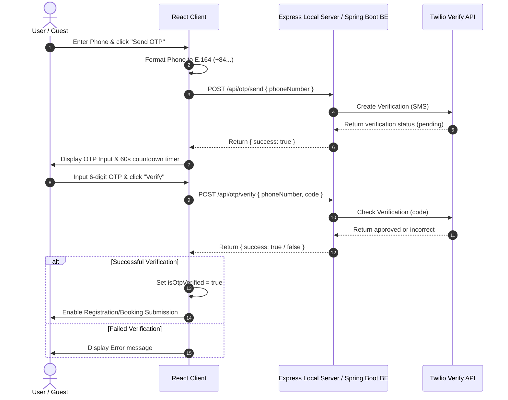

# Design Specification: Twilio OTP Verification & Service CRUD State Management

This document specifies the technical design for integrating real Twilio OTP verification, reorganizing the customer dashboard state, and implementing dynamic service management (CRUD) in the AutoWash Pro system.

---

## 1. Twilio OTP Verification Architecture

To prevent exposing Twilio Account credentials on the front-end, a secure proxy architecture is used. Front-end client calls a backend helper service (Express Node.js for local testing, Spring Boot in production) which interfaces with the Twilio Verify API.

### 1.1. Twilio Verify API Flow

Twilio's Verify Service handles OTP generation, rate-limiting, SMS dispatching, and code validation.



### 1.2. Phone Number E.164 Normalization

Before dispatching the phone number to Twilio, the front-end will normalize the Vietnamese local formats (e.g. `0901234567`) to E.164 standard format (e.g. `+84901234567`):

```typescript
export const formatToE164 = (phone: string): string => {
  let cleaned = phone.replace(/\D/g, ''); // Remove non-numeric characters
  if (cleaned.startsWith('0')) {
    cleaned = '84' + cleaned.slice(1);
  }
  return '+' + cleaned;
};
```

---

## 2. Secure Local Express OTP Service Scaffolding

For local demonstration and development, we scaffold a minimal Express backend in the `Back-end/otp-service/` folder.

### 2.1. Environment Variables (`.env`)
```env
TWILIO_ACCOUNT_SID=ACXXXXXXXXXXXXXXXXXXXXXXXXXXXXXXXX
TWILIO_AUTH_TOKEN=your_auth_token_here
TWILIO_VERIFY_SERVICE_SID=VAXXXXXXXXXXXXXXXXXXXXXXXXXXXXXXXX
PORT=3001
```

### 2.2. Package Configuration (`package.json`)
```json
{
  "name": "autowash-otp-service",
  "version": "1.0.0",
  "type": "module",
  "main": "server.js",
  "scripts": {
    "start": "node server.js"
  },
  "dependencies": {
    "cors": "^2.8.5",
    "dotenv": "^16.4.5",
    "express": "^4.19.2",
    "twilio": "^5.0.4"
  }
}
```

### 2.3. Server Implementation (`server.js`)
```javascript
import express from 'express';
import cors from 'cors';
import dotenv from 'dotenv';
import twilio from 'twilio';

dotenv.config();

const app = express();
app.use(cors());
app.use(express.json());

const accountSid = process.env.TWILIO_ACCOUNT_SID;
const authToken = process.env.TWILIO_AUTH_TOKEN;
const verifyServiceSid = process.env.TWILIO_VERIFY_SERVICE_SID;

if (!accountSid || !authToken || !verifyServiceSid) {
  console.error("CRITICAL: Missing Twilio configuration in environment variables.");
}

const client = twilio(accountSid, authToken);

app.post('/api/otp/send', async (req, res) => {
  const { phoneNumber } = req.body;
  if (!phoneNumber) {
    return res.status(400).json({ success: false, error: 'Phone number is required.' });
  }

  try {
    const verification = await client.verify.v2.services(verifyServiceSid)
      .verifications
      .create({ to: phoneNumber, channel: 'sms' });
    res.status(200).json({ success: true, sid: verification.sid });
  } catch (error) {
    res.status(500).json({ success: false, error: error.message });
  }
});

app.post('/api/otp/verify', async (req, res) => {
  const { phoneNumber, code } = req.body;
  if (!phoneNumber || !code) {
    return res.status(400).json({ success: false, error: 'Phone number and verification code are required.' });
  }

  try {
    const verificationCheck = await client.verify.v2.services(verifyServiceSid)
      .verificationChecks
      .create({ to: phoneNumber, code });
    if (verificationCheck.status === 'approved') {
      res.status(200).json({ success: true });
    } else {
      res.status(400).json({ success: false, error: 'Incorrect OTP code.' });
    }
  } catch (error) {
    res.status(500).json({ success: false, error: error.message });
  }
});

const PORT = process.env.PORT || 3001;
app.listen(PORT, () => console.log(`Twilio OTP proxy server listening on port ${PORT}`));
```

---

## 3. Production Spring Boot Integration Blueprint

To migrate from the local Express proxy to production, developers must configure Spring Boot with the following components.

### 3.1. Maven Dependencies (`pom.xml`)
```xml
<dependency>
    <groupId>com.twilio.sdk</groupId>
    <artifactId>twilio</artifactId>
    <version>9.0.0</version>
</dependency>
```

### 3.2. Twilio Configurations
`application.properties`:
```properties
twilio.account.sid=ACXXXXXXXXXXXXXXXXXXXXXXXXXXXXXXXX
twilio.auth.token=your_auth_token_here
twilio.verify.service.sid=VAXXXXXXXXXXXXXXXXXXXXXXXXXXXXXXXX
```

Java Config:
```java
@Configuration
public class TwilioConfig {
    @Value("${twilio.account.sid}")
    private String accountSid;

    @Value("${twilio.auth.token}")
    private String authToken;

    @PostConstruct
    public void init() {
        Twilio.init(accountSid, authToken);
    }
}
```

### 3.3. OTP Controller Endpoint
```java
@RestController
@RequestMapping("/api/otp")
@CrossOrigin(origins = "*")
public class OtpController {

    @Value("${twilio.verify.service.sid}")
    private String verifyServiceSid;

    @PostMapping("/send")
    public ResponseEntity<?> sendOtp(@RequestBody OtpRequest request) {
        try {
            Verification verification = Verification.creator(
                    verifyServiceSid,
                    request.getPhoneNumber(),
                    "sms"
            ).create();
            return ResponseEntity.ok(Map.of("success", true, "sid", verification.getSid()));
        } catch (Exception e) {
            return ResponseEntity.status(500).body(Map.of("success", false, "error", e.getMessage()));
        }
    }

    @PostMapping("/verify")
    public ResponseEntity<?> verifyOtp(@RequestBody OtpVerificationRequest request) {
        try {
            VerificationCheck verificationCheck = VerificationCheck.creator(
                    verifyServiceSid,
                    request.getCode()
            ).setTo(request.getPhoneNumber()).create();

            if ("approved".equals(verificationCheck.getStatus())) {
                return ResponseEntity.ok(Map.of("success", true));
            } else {
                return ResponseEntity.status(400).body(Map.of("success", false, "error", "Incorrect OTP code."));
            }
        } catch (Exception e) {
            return ResponseEntity.status(500).body(Map.of("success", false, "error", e.getMessage()));
        }
    }
}
```

---

## 4. Customer Dashboard Logical State & Sidebar Mapping

To align the customer area, the tab selection is expanded to support 6 virtual states in `CustomerDashboard.tsx`.

### 4.1. Supported Virtual Tab Options
The `activeTab` type is updated:
```typescript
type DashboardTab = 'overview' | 'booking' | 'vehicles' | 'history' | 'promotions' | 'loyalty';
```

### 4.2. Tab Transition Logic
*   **Booking Tab Trigger**: Switching to `'booking'` hides the dashboard summaries and loads the standard `BookingPage` wizard.
*   **Booking Wizard Integration**: When booking completes or is cancelled/exited, the component invokes a callback resetting the Dashboard `activeTab` back to `'overview'`.
*   **Upcoming Appointment Logic**: A helper filters existing bookings belonging to the active client:
    ```typescript
    const getUpcomingBooking = (customerId: string, bookings: Booking[]): Booking | null => {
      const activeBookings = bookings.filter(
        b => b.customerId === customerId && 
        (b.status === 'PENDING' || b.status === 'CONFIRMED')
      );
      if (activeBookings.length === 0) return null;
      // Return the closest booking by date and time
      return activeBookings.reduce((closest, curr) => {
        const closestTime = new Date(`${closest.bookingDate}T${closest.bookingTime}`).getTime();
        const currTime = new Date(`${curr.bookingDate}T${curr.bookingTime}`).getTime();
        return (currTime < closestTime) ? curr : closest;
      });
    };
    ```

---

## 5. Dynamic Service & Combo Management (CRUD)

Services are moved from a static file to a reactive state managed inside the `BookingContext`.

### 5.1. Service Interface Representation
```typescript
export interface ServiceItem {
  id: string;
  name: string;
  price: number;
  duration: string;
  detail: string;
  category: 'rua_xe_and_combo' | 've_sink_trong' | 've_sinh_ngoai' | 'xu_ly_be_mat' | 'bao_ve';
  isVisible: boolean;
}
```

### 5.2. Data Mutations in `BookingContext.tsx`
Context offers the following operations modifying the reactive array `services` (initialized with the baseline VinaWash menu):
*   `addService(service: Omit<ServiceItem, 'id'>)`: Appends service with a unique generated ID.
*   `updateService(id: string, updates: Partial<ServiceItem>)`: Modifies fields on matching ID.
*   `deleteService(id: string)`: Removes the service from the active selection lists. (History entries references remain valid as they record snapshot details at transaction time).
*   `toggleServiceVisibility(id: string)`: Reverses the boolean `isVisible`.

All modifications are stored to `localStorage` under keys `autowash_services` to preserve configuration across page refreshes.

### 5.3. Dynamic Selection Filtering
In the customer scheduling steps, services are loaded directly from the React context and filtered:
```typescript
const visibleServices = services.filter(s => s.isVisible);
```
This guarantees hidden services are never selectable by customers, while remaining editable by the system admin.
